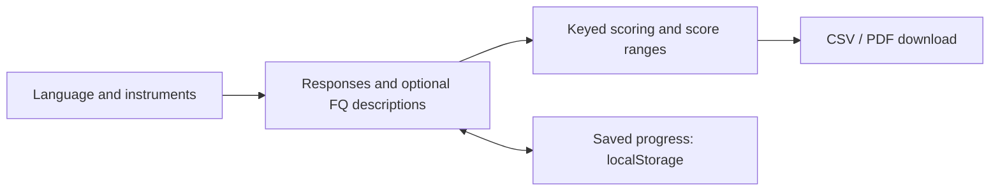
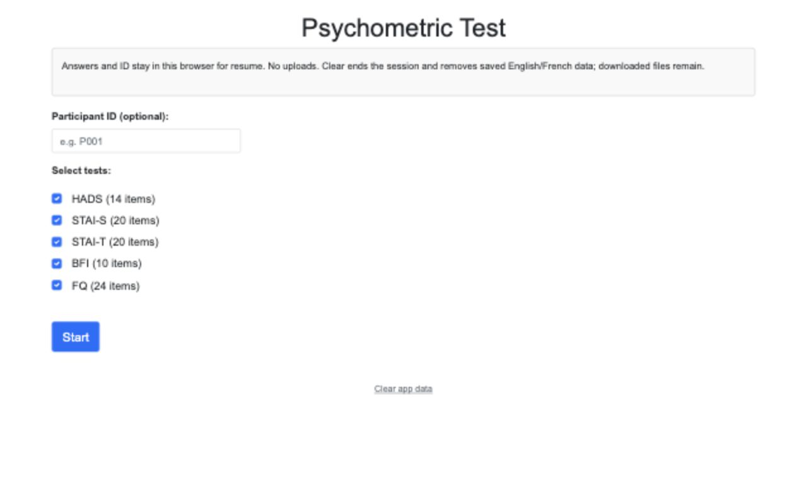
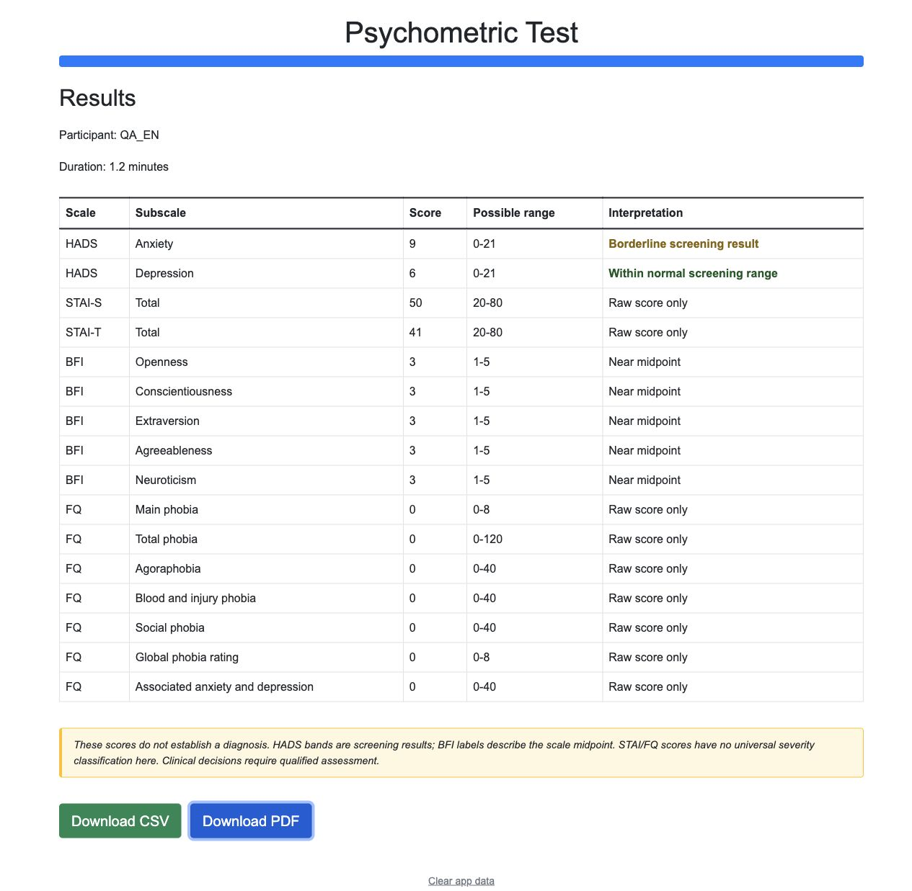

# Psychometric

**Psychometrics · Bilingual · Scoring · Export**

## Overview

English/French questionnaires: **5 instruments, 88 items**. [Open app](https://urmeo.github.io/Psychometric/), or open `index.html` locally. No build or server.

### Data flow



## Instruments

| Instrument | Items | Output |
|:-----------|------:|:-------|
| HADS | 14 | Anxiety/depression: **0–21 each**, screening bands |
| STAI-S | 20 | State anxiety: **20–80**, raw score |
| STAI-T | 20 | Trait anxiety: **20–80**, raw score |
| BFI-10 | 10 | Five trait means: **1–5 each**, descriptive |
| FQ | 24 | Total phobia: **0–120**; three phobia subscales and associated anxiety/depression: **0–40 each**; main/global phobia: **0–8 each** |

STAI: English **Form X-1/X-2**, French **Form Y-1/Y-2**; keys differ. French BFI-10: [Courtois et al. (2020)](https://www.em-consulte.com/article/1361431).

## Features

- Choose instrument combinations.
- Resume progress; clear ends the session and removes both language saves.
- CSV/PDF: responses, descriptions, scores, forms, revision, timestamps.

Unsupported PDF characters export intact as UTF-8 CSV.




## Tech stack

| Layer | Tools |
|:------|:------|
| Interface | HTML, CSS, Bootstrap 5 |
| Scoring and storage | Vanilla JavaScript, localStorage |
| Downloads | CSV/Blob, jsPDF |
| Checks | Node.js, Puppeteer |

## Verify

Node **22.12+**.

```sh
npm ci
npm run check:vendor
npm test
```

## Limits

1. No diagnosis: HADS screens, BFI describes, STAI/FQ report raw scores.
2. Use coded IDs. Saved progress and exports contain sensitive responses; clearing saves leaves downloads.
3. [MIT](LICENSE) covers software only. STAI/HADS require permission; see [instrument rights](NOTICE.md).

## References

| Instrument | Source |
|---|---|
| HADS | [Snaith (2003)](https://link.springer.com/article/10.1186/1477-7525-1-29) |
| STAI | [Mind Garden, instrument and forms](https://www.mindgarden.com/145-state-trait-anxiety-inventory-for-adults) |
| BFI-10 | [Rammstedt & John (2007)](https://www.sciencedirect.com/science/article/pii/S0092656606000195) |
| FQ | [Marks & Mathews (1979)](https://www.sciencedirect.com/science/article/pii/000579677990041X) |
